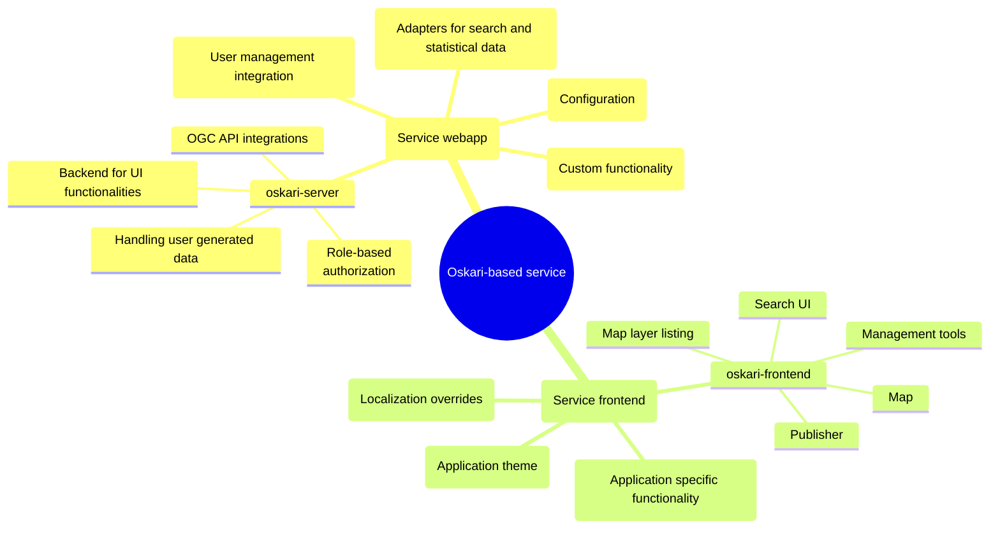
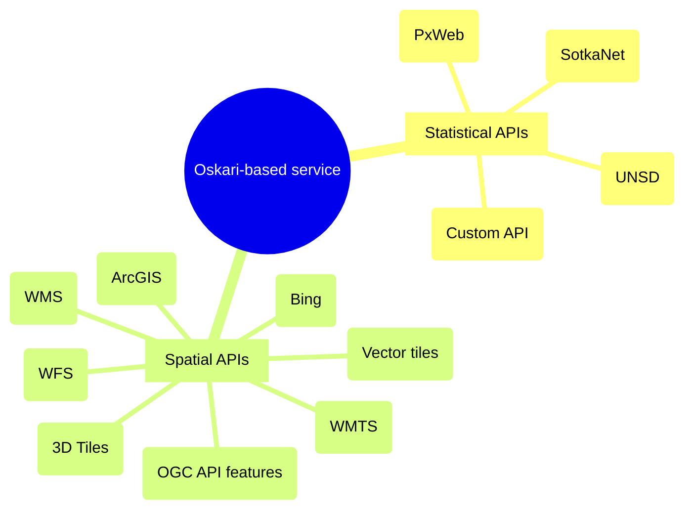

## Application environment

An Oskari-based web application consists of frontend code for browser-based user interface and backend functionalities that are run on the server. The user interface is implemented in JavaScript and the server functionality in Java. Both, the frontend and the backend, are built with extensibility in mind.

An example for building your own service is provided as a template application that can be run as is and it enables an easy starting point for customizing the service.

The pictures below shows the generic idea of Oskari.

### Software overview

Oskari-frontend and oskari-server offer a solid base framework and ready-to-use building blocks for running an Oskari-based service. Services can be customized and configured in many ways.

### Data source overview

Data is usually fetched to Oskari from other services so you can fully utilize an existing spatial data infrastructure.
It's more about separation of concerns regarding the software and nothing stops you from hosting separate data services just for Oskari if needed.

