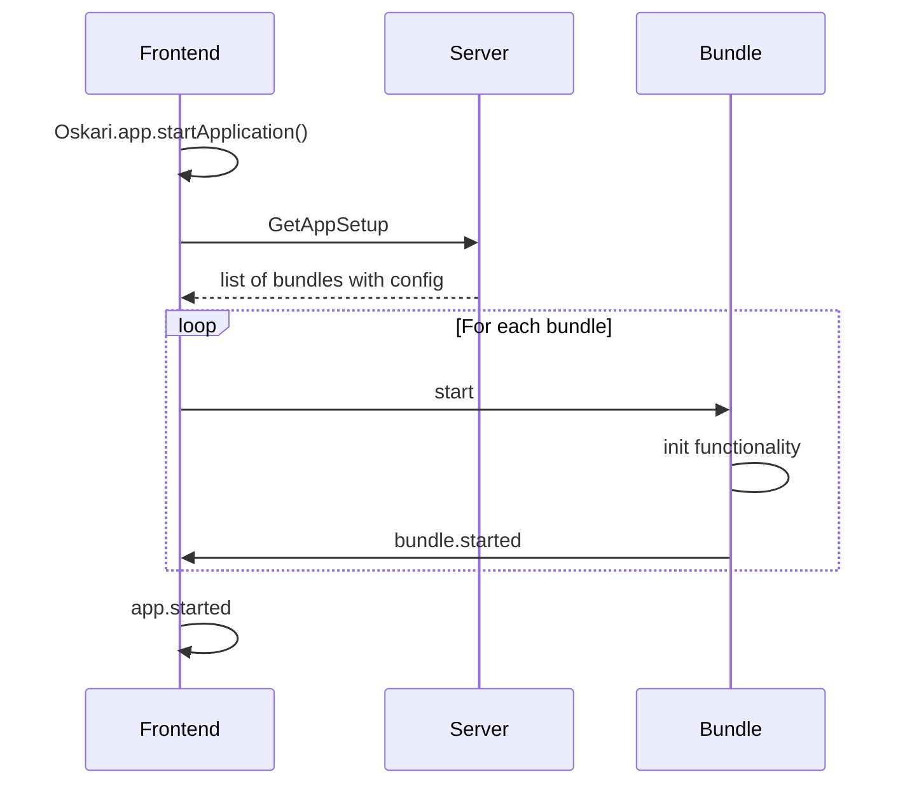

## Frontend

The user interface is a Javascript-based single-page app. The UI is built by selecting a series of bundles that provide functionalities/capabilities for an application. You can mix and match the bundles or create new ones to customize the application for your needs.

Bundles are used as uniform containers to ship and share new functionality to the application setups. Additions to an existing functionality are implemented as plugins shipped within the bundles.

A bundle can work "as is" for providing its functionality with its own user interface and/or it can provide a documented API that can be used to interact with the functionality programmatically. One example of a bundle that doesn't have an UI itself would be a bundle called `drawtools` that only provides an API that is used by measurement tools, my places functionality and others that has the user "draw" something on the map. The API also helps implementing a customized drop-in replacements for functionalities when required.

### Frontend architecture

An Oskari-based frontend application includes the Oskari framework code and a selection of bundles that implement functionalities for the application. Bundles have a lifecycle and are started in sequence. Bundles can communicate with each other using events, requests and services. The framework code of Oskari provides the messaging system for events, requests and service registry but also an API which bundles need to implement so they can be included in an Oskari based application like having lifecycle functions/a starting point that can be called when the functionality is started.

The sequence diagram below explains what happens in the frontend initialisation process (try reloading the page if it's not rendered properly).

The frontend code calls the `Oskari.app.startApplication()` which triggers a call for the server action route called `GetAppSetup`. The `GetAppSetup` response lists all the bundles that should be started for that specific application and the configuration and state of those bundles (like which layers are on the map and what are the coordinates for the center of the map etc). The frontend then proceeds with starting the requested bundles with the included configuration in sequence until the whole application has been started. An event is triggered after each started bundle and another once the whole application has been started that enables programmatically react to such lifecycle events.

The bundle called `mapfull` is usually a starting point for the bundle sequence as it creates the map implementation that most functionalities expect to be present to be useful.

**Bundle functionality**

* Bundles can provide an API for other bundles to request some operation through a request handler.
* A bundle can provide a request class and register a handler for the request in the Oskari framework. This is refered to as the request API for the bundle and should be fairly stable.
* Another bundle can then send the request which will be processed by the other bundle.
* Another way to communicate with other bundles is to send out an event through Oskari core.
* Any bundle registered as an eventlistener for the given event is then notified about the event.

### Libraries and technologies

Oskari frontend uses the following libraries and technologies (for details see package.json on the oskari-frontend repository):

* OpenLayers (map implementation)
* jQuery (older UI implementations, migrating towards React)
* React (current UI implementations)
* Ant Design (UI components and icons)
* CesiumJS
* Lo-Dash
* geostats.js
* D3.js

You can get a list of licenses for all the libraries with npm, for example by running: 

    npx license-checker
    
Just to get summary of licenses you can add --summary after the command:

    npx license-checker --summary

### Source code and folder structure

You can find an Oskari-based sample application source code [here](https://github.com/oskariorg/sample-application).

The sample application frontend source code has the following folder structure:
/applications - Definitions for application setups combining bundles into a specific application
/bundles - Implementation for application specific bundles
/packages - The main import point for application specific bundles

We are likely to remove the packages folder in the future and just have the bundle.js or similar in the bundles folder as this is mostly an older relic for the framework part. The path of the bundle.js nor the filename doesn't really matter any more. What matters is what is referenced on the main.js file under applications and that import points to the actual place where the main starting point (bundle.js currently) is located.

You can find Oskari frontend source code [here](https://github.com/oskariorg/oskari-frontend).

Oskari frontend source code has the following folder structure:
/api - The documentation of bundles and APIs they provide with a change log of changes to the API
/bundles - Implementation files for extension bundles
/packages - Definition files for extension bundles (mainly linking to files under bundles-folder)
/resources - Common CSS styles/images
/src - Code for Oskari framework
/tools - Random templates and scripts for generating CSV-files based on localization (most likely deprecated)
/webpack - Helpers and configurations for current build tools
/libraries - Older jQuery plugins and other dependencies/libraries that are not reasonably available through npm

The main folders are the bundles (for debugging functionality implementations), packages (for linking functionalities to be used in applications), src (for framework code) and webpack (for build scripts). The packages folder is likely to be removed in the future and when it is, the imports on the applications need to be updated (but this is a light change and will be documented on the migration guide when done).

The folder structure follows a pattern where the first folder under the base folder is a namespace folder. Oskari uses `framework` and `mapping` for most of the bundles and `admin` for admin tools, but this is optional and you can separate your bundles to own namespace. The next folder in the structure is named bundle. This is just a convention and is not a functional requirement. The next folder is named after the `{bundle-identifier}`.