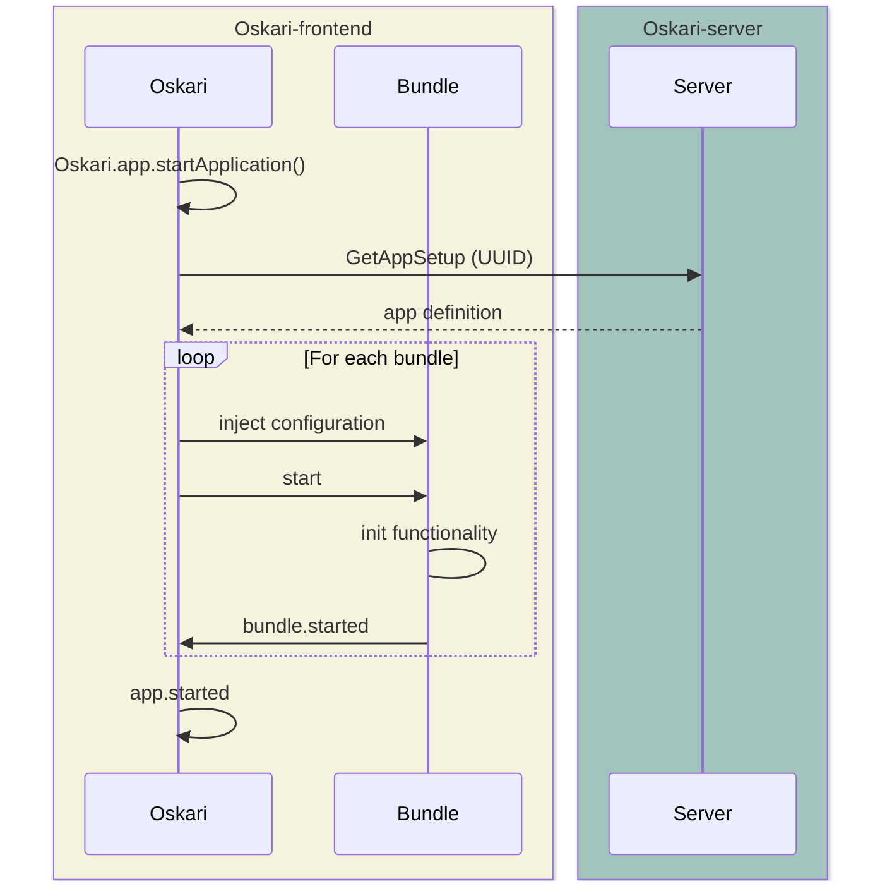

## Frontend

The user interface for Oskari-based services usually is a Javascript-based single-page app. The UI is built by selecting a series of bundles that provide functionalities/capabilities for an application. You can mix and match the bundles or create new ones to customize the application for your needs.

Bundles are used as uniform containers to ship and share new functionality to the application setups. Additions to an existing functionality are implemented as plugins shipped within the bundles.

A bundle can work "as is" for providing its functionality with its own user interface and/or it can provide a documented API that can be used to interact with the functionality programmatically. One example of a bundle that doesn't have an UI itself would be a bundle called `drawtools` that only provides an API that is used by measurement tools, my places functionality and others that has the user "draw" something on the map. The API also helps implementing a customized drop-in replacements for functionalities when required.

### Frontend architecture

An Oskari-based frontend application includes the Oskari framework code and a selection of bundles that implement functionalities for the application. Bundles have a lifecycle and are started in sequence. Bundles can communicate with each other using events, requests and services. The framework code of Oskari provides the messaging system for events, requests and service registry but also an API which bundles need to implement so they can be included in an Oskari based application like having lifecycle functions/a starting point that can be called when the functionality is started.

The sequence diagram below explains what happens in the frontend initialization process (try reloading the page if the diagram is not rendered properly).


```mermaid
sequenceDiagram
  box rgb(245, 242, 222) Oskari-frontend
  participant Oskari as Oskari
  participant Bundle as Bundle
  end
  box rgb(163, 196, 188) Oskari-server
  participant Server as Server
  end

  Oskari ->> Oskari: Oskari.app.startApplication()
  Oskari ->> Server: GetAppSetup (UUID)
  Server -->> Oskari: app definition
  loop For each bundle
    Oskari ->> Bundle: inject configuration
    Oskari ->> Bundle: start
    Bundle -> Bundle: init functionality
    Bundle ->> Oskari: bundle.started
  end
  Oskari ->> Oskari: app.started
```

The frontend in started by the application code calling `Oskari.app.startApplication()` (in applications index.js for example) which triggers a call for the server action route called `GetAppSetup`. The `GetAppSetup` response lists all the bundles that should be started for that specific application and includes the configuration and state of those bundles (like which layers are on the map and what are the coordinates for the center of the map etc). The application to start is noted by an UUID when the page is opened (usually a parameter on the page URL) but the server has several options to default an appsetup based on user role etc. The frontend then proceeds with starting the requested bundles with the included configuration in sequence until the whole application has been started. An event is triggered after each started bundle and another once the whole application has been started that enables programmatically react to such lifecycle events.

The bundle called `mapfull` is usually a starting point for the bundle sequence as it creates the map implementation that most functionalities expect to be present when started.

**Bundle functionality**

* Bundles can provide an API for other bundles to request some operation through a request handler.
* A bundle can provide a request class and register a handler for the request in the Oskari framework. This is refered to as the request API for the bundle and should be fairly stable.
* Another bundle can then send the request which will be processed by the other bundle.
* Another way to communicate with other bundles is to send out an event through Oskari framework.
* Any bundle registered as an eventlistener for the given event is then notified about the event.

### Libraries and technologies

Oskari frontend uses the following libraries and technologies (for details see `package.json` on the [oskari-frontend](https://github.com/oskariorg/oskari-frontend) repository):

* OpenLayers (map implementation)
* jQuery (older UI implementations, migrating towards React)
* React (current UI implementations)
* Ant Design (UI components and icons)
* CesiumJS (3d map implementation)
* Lo-Dash
* geostats.js
* D3.js

You can get a list of licenses for all the libraries with npm, for example by running: 

    npx license-checker
    
Just to get summary of licenses you can add --summary after the command:

    npx license-checker --summary


### Source code and folder structure

The frontend for Oskari-based applications can be divided into two (or more) parts:
- the application that can be customized for a specific need
- oskari-frontend that provides the frontend framework, built-in UI-component library and bundles that can be used as building blocks when creating applications.
- you can also use bundles from oskari-frontend-contrib repository like ones from oskari-frontend and/or another third party repository

You can find an Oskari-based sample application source code [here](https://github.com/oskariorg/sample-application).

The sample application frontend source code has the following folder structure:
```
/applications - References to bundles that will be used in a specific application
/bundles - Implementation for application specific bundles
```
The applications folder has for example `geoportal` and `embedded` as applications as both of these use different set of bundles.
 For the sample-application the `geoportal` is what you expect to see when opening the Oskari application and lists all the bundles that will be used on different `geoportal` views on the example application (https://demo.oskari.org etc).
 The `embedded` application references the bundles that users can select to be included when publishing maps from the geoportal. We need to reference any bundle that could be started on an embedded map, but we can still optimize by using the `oskari-bundle` loader for ones that are always used (like the map) and use `oskari-lazy-bundle` to reference ones that see less use (like thematic maps). This way the file that end-users need to download when opening the map only has the ones that are common to get a smaller file size while also enabling users to use the more specific functionalities that are only loaded when used on the embedded maps.

You can find Oskari frontend source code [here](https://github.com/oskariorg/oskari-frontend).

Oskari frontend source code has the following folder structure:
```
/api - The documentation of bundles and APIs they provide with a change log of changes to the API
/bundles - Implementation files for built-in bundles
/packages - Legacy-definition files for bundles (content is being migrated to bundles).
/resources - Common CSS styles/images
/src - Code for Oskari framework
/tools - Random templates and scripts for generating CSV-files based on localization
/webpack - Helpers and configurations for current build tools
/libraries - Older jQuery plugins and other dependencies/libraries that are not reasonably available through npm
```
The main folders are:
- bundles (for debugging functionality implementations)
- src (for framework code)
- webpack (for build scripts)

 Note! We have started migrating the contents under `packages` folder to `bundles` with a newer format. These two formats require different Webpack-loaders when referenced from the application `main.js` file.

The folder structure for bundles follows a pattern where the first folder under the base folder is a namespace folder. Oskari uses `framework` and `mapping` namespaces for most of the bundles and `admin` for admin tools. The namespace is purely cosmetic and is for grouping the bundles/organizational purposes. When creating app-specific bundles you don't have to use a namespace but you can if you wish. The next folder after the namespace is named after the `{bundle-identifier}`. Note that under the `packages` folder there can be a folder with the name `bundle` in between. 
