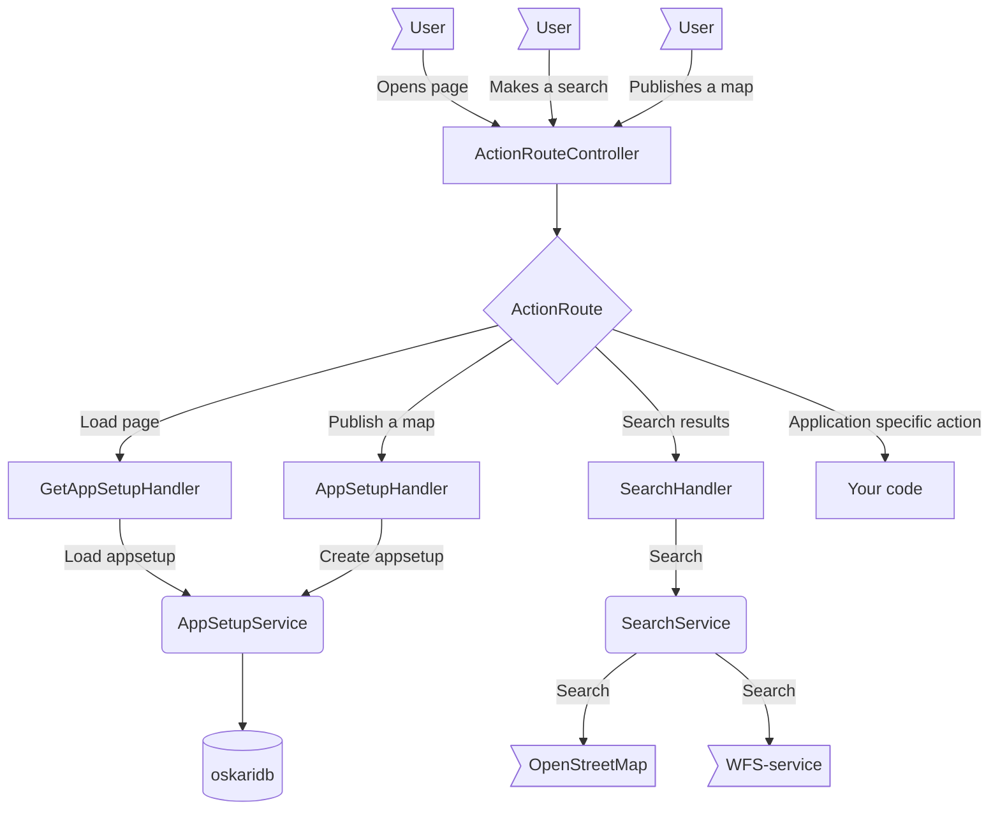

## Backend

Backend functionality of the platform is implemented as a Java servlet, which can also be extended to handle new functionality.

### Backend architecture

Oskari backend flow architecture depicted:

The Java webapp archive (war-file) for Oskari server is packaged as oskari-map.war in sample-server-extension (the webapp-map module).

It handles most of the server side functionality alone, but doesn't need to include much code as it uses the Maven modules from `oskari-server` that handle most of the things it needs.

The webapp is extensible and you can add more modules from oskari-server or remove ones you don't need in your app. It is also very easy to add more handlers for any application specific needs when creating your own geoportal/web mapping server.

The backend architecture in oskari-server can be divided into three layers: service layer, control layer and interface layer:
1) The interface layer is very light with Spring framework Controllers for handling requests and can be easily substituted to run as portlets or similar.
2) The controllers pass concrete HTTP-requests on to Oskari control-modules that can further process the requests and write responses.
3) Services are used by the control-modules to handle business-logic. The service-modules could (in theory) be used in any Java-based software as libraries.

**Service layer**

Service modules should be common libraries usable in any application. The actual business logic for Oskari operations should be in these modules.

* service-base has some common helpers and domain classes which are used throughout Oskari backend
* service-permission is a generic authorization lib for deciding who gets to see/do what
* service-search is a generic search lib that can be extended by adding and registering search channels.
* service-map has most (maybe a bit too much) of the business logic for servicing the Oskari functionalities
* service-control defines the control/routing structures/interfaces for control-layer to build upon
* shared-test-resources has some common helpers/templates to help testing

**Control layer**

Control modules build on top of the service layer.

* control-base is the basis for all control-modules and has most of the basic request handlers needed by the Oskari frontend.
	* NOTE! control-base contains some very specific functionalities that should be separated into separate control-extensions (for example thematic maps support)
* control-myplaces provides funtionality related to myplaces functionality.
* control-example provides example implementations for functionalities required by Oskari but usually overridden by platform specific functionalities such content management for user guide etc.
* content-resources has tools, templates and scripts for populating and migrating the database

Functions:
* Handles requests made by Oskari frontend
* Parses request parameters for input values to be used on service invocations
* calls one or more services to do business logic
* format a response based on service response

**Interface layer**

The interface-modules build on top of the control-modules. Basically an HTTP interface with reference implementations for:

* HTTP Servlet: oskari-server/servlet-map
* Webapp: sample-server-extension/webapp-map

Responsible for:

* Handling user sessions
* Generating an ActionParameters object based on incoming request abstracting/normalizing the request for control layer
* Forwarding the request to control layer

### Libraries and technologies

Oskari backend uses the following libraries and technologies:

* Tomcat/Jetty or similar as Java servlet container
* PostgreSQL (database)
* PostGIS (spatial data extension for PostgreSQL)
* Redis (for caching and communication in clustered server environment)

Based on your needs you can decorate your architecture by adding components like these in front of the Oskari server:

* HAProxy (proxy, load balancer)
* Apache HTTPD (proxy, load balancer)
* Nginx (proxy, load balancer)
* F5 load balancer

Having HTTPD or nginx for serving the static frontend application and passing other requests to Tomcat/Jetty is a popular choice.

### Source code and folder structure

You can find Oskari backend source code in [here](https://github.com/oskariorg/oskari-server).
 It doesn't have a runnable webapp as that is usually (heavily) customized per application requirements but you can find a template to start customization [here](https://github.com/oskariorg/sample-server-extension).
