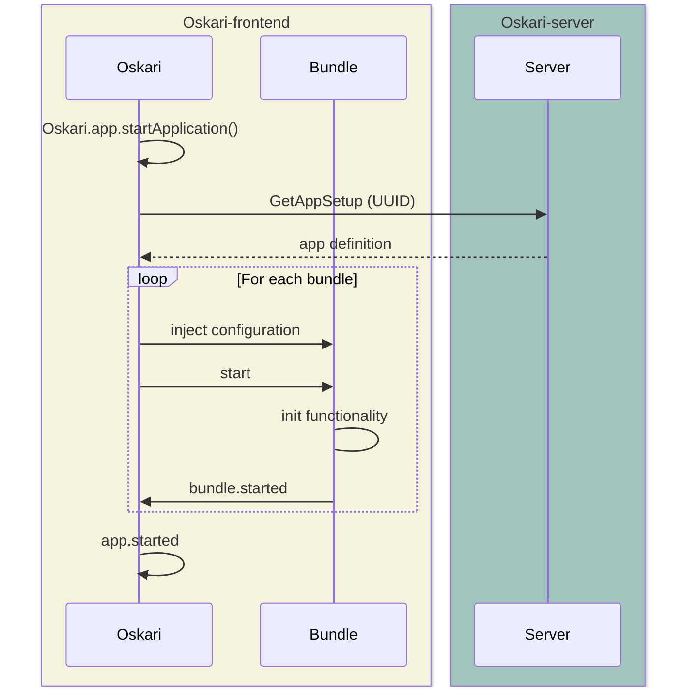

# Frontend framework

An Oskari-based frontend application includes the Oskari framework code and a selection of bundles that implement functionalities for the application. Bundles have a lifecycle and are started in sequence. Bundles can communicate with each other using events, requests and services. The framework code of Oskari provides the messaging system for events, requests and service registry but also an API which bundles need to implement so they can be included in an Oskari based application like having lifecycle functions/a starting point that can be called when the functionality is started.

The sequence diagram below explains what happens in the frontend initialization process (try reloading the page if the diagram is not rendered properly).

The frontend in started by the application code calling `Oskari.app.startApplication()` (in applications `index.js` for example) which triggers a call for the server action route called `GetAppSetup`. The `GetAppSetup` response lists all the bundles that should be started for that specific application as a `startupSequence` and includes the `configuration` including initial state of those bundles (like which layers are on the map and what are the coordinates for the center of the map etc). The application to start is noted by an `UUID` when the page is opened (usually a parameter on the page URL) but the server has several options to default an appsetup based on user role etc. The frontend then proceeds with starting the requested bundles with the included configuration in sequence until the whole application has been started. An event is triggered after each started bundle and another once the whole application has been started that enables programmatically react to such lifecycle events.

The bundle called `mapfull` is usually a starting point for the bundle sequence as it creates the map implementation that most functionalities expect to be present when started.
This documentation section contains documentation for the frontend framework that Oskari frontend provides and what it means for applications that are built using [oskari-frontend](https://github.com/oskariorg/oskari-frontend).

## oskari-frontend directory structure

Oskari frontend source code has the following folder structure:
- `/api` - The documentation for bundles and API they provide with a change log of changes to the API
- `/bundles` - Implementation files for built-in bundles
- `/resources` - Common CSS styles/images
- `/src` - Code for Oskari framework
    - `src/react` - UI-components library
- `/tools` - Random templates and scripts for generating CSV-files based on localization
- `/webpack` - Helpers and configurations for current build tools
- `/libraries` - Older jQuery plugins and other dependencies/libraries that are not reasonably available through npm
- (`/packages`) - Legacy-definition files for bundles (content is being migrated to bundles with new syntax).

The main folders are:
- `bundles` (functionality implementations you can use in applications)
- `src` (for framework code)
- `webpack` (for build scripts)

Note! We have started migrating the contents under `packages` folder to `bundles` with a newer format. These two formats require different Webpack-loaders when referenced from the application `main.js` file.

The folder structure for `bundles` follows a pattern where the first folder under the base folder is a `namespace` folder. Oskari uses `framework` and `mapping` namespaces for most of the bundles and `admin` for admin tools. The namespace is purely cosmetic and is for grouping the bundles/organizational purposes. When creating app-specific bundles you don't have to use a namespace but you can if you wish. The next folder after the namespace is named after the `{bundle-identifier}`. Note that under the `packages` folder there can be a folder with the name `bundle` in between.

### Frontend libraries and technologies

Oskari frontend uses the following libraries and technologies (for details see `package.json` on the [oskari-frontend](https://github.com/oskariorg/oskari-frontend) repository):

* OpenLayers (map implementation)
* jQuery (older UI implementations, migrating towards React)
* React (current UI implementations)
* Ant Design (UI components and icons)
* CesiumJS (3d map implementation)
* Lo-Dash
* geostats.js
* D3.js

You can get a list of licenses for all the libraries with npm, for example by running: 

    npx license-checker
    
Just to get summary of licenses you can add --summary after the command:

    npx license-checker --summary
