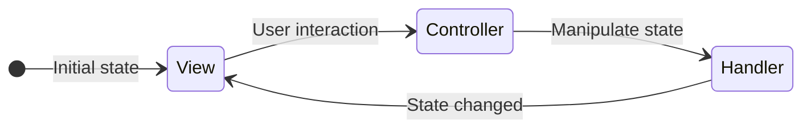

## Bundles

A bundle can be considered as a building block in an Oskari application. A bundle provides some documented functionality and optionally an API that it offers to other bundles for interaction purposes. A bundle has a `bundle id` that is used as a name for the documention of the functionality and the API that the bundle provides, but can have multiple parallel implementations with the idea that switching between implementations is a drop-in replacement. An example of this could be a 2D (OpenLayers) and a 3D (Cesium) implementation of the map functionality (`mapmodule`). They both integrate with the rest of the application by providing and using the same documented API, but offer a different experience for the end-user.

The implementation details of a bundle should not really matter, but the API and the functionality they provide should be documented and either be backwards compatible or any changes need to be documented in the changelog.
Notice that changes to the API can be very hard to manage for developers that use it to control embedded maps that are published from Oskari-based services that they themselves don't control. The API changes for the embedded maps at that exact time when the Oskari instance is updated with new version. It is good to keep in mind when designing API changes.

A comprehensive versioned documentation of all available bundles in `oskari-frontend` can be found [here](https://oskari.org/documentation/api/bundles/latest/) (generated from the [api-folder](https://github.com/oskariorg/oskari-frontend/tree/master/api)).

### Bundle implementation

Minimal implementation of a bundle is just having a factory function for the bundle that returns an instance of the bundle implementation:

```javascript
import { BasicBundleInstance } from 'oskari-ui/BasicBundleInstance';

class MyBundleInstance extends BasicBundleInstance {
    start (sandbox) {
        super.start(sandbox);
        console.log('Hello world')
    }
}

Oskari.bundle('hello-world', () => new MyBundleInstance());
```

Here the `Oskari.bundle()` function is used to register the factory function for bundle id `hello-world`.
You could save the code to `oskari-frontend/bundles/sample/hello-world/index.js` to have it accessible for any Oskari-based applications.
In the path:
- `bundles` is the folder that holds all the bundle implementations
- `sample` would be a namespace for organizing/grouping bundles (you can skip this on application specific bundles)
- `hello-world` should match the bundle id (just to make things easier to find, but is not a requirement)

To use this in an application you would import it to your applications `main.js` with:

```javascript
import 'oskari-bundle!oskari-frontend/bundles/sample/hello-world';
```

Or you could save it application specific bundle as `your-frontend-repo/anywhere_really/whatever.js` and just update the reference for the import on 
 `your-frontend-repo/applications/myapp/main.js`:

```javascript
import 'oskari-bundle!../../anywhere_really/whatever.js';
```

After that the bundle with id `hello-world` can be started as part of your application.
A good practice is to separate the bundle instance to its own file and import it on the `index.js` file so the factory file stays as clean and simple as it can.

**Note!** Making the bundle accessible in your application with import on `main.js` only means that the code is packaged as part of the javascript file that is loaded by the end-users browser.
It doesn't mean it gets run/started on your application.

### Starting a bundle as part of an application

To start a bundle as part of the application it **needs** to be included in the javascript file that is loaded by the end-users browser. This is done by importing it on the `main.js` file of the application.

To actually start an included bundle, there are two choices:
1) have the bundle be referenced in the `GetAppSetup` response from the server (recommended)
2) for testing you can start it in the developer console with `Oskari.app.playBundle({ bundlename: 'hello-world' })`

Applications usually have an `index.js` file that fetches the `GetAppSetup` response from the server with `Oskari.app.loadAppSetup()`.

If you need to give the bundle a config and know when it has been started you can give the config as second parameter and a callback function as third:

```javascript
Oskari.app.playBundle({
    "bundlename": "coordinatetool"
}, {
    conf: {
        someVariable: 'some value'
    }
},
() => {
    console.log('Bundle started');
});
```

You can also give the callback function as the second parameter to `playBundle()` function.

### Bundle lifecycle

When a bundle is started by the framework:

**1\)** the factory function is called to create an `instance` for the bundle.

**2\)** after creating an instance, variables are injected into the instance object:

```javascript
instance.mediator = {
    bundleId,
    instanceId
}
```
Where:
- `bundleId` is the id you expect (`hello-world` in the example)
- `instanceId` is something that can be used to differentiate multiple instances of the same bundle in a more complex application (defaults to bundle id).

`Oskari.app.getConfiguration()` has configuration for all of the bundles in the application and is usually
 populated from the `GetAppSetup` response from the server with `Oskari.app.loadAppSetup()`. This configuration has keys matching bundle instanceIds (defaults to bundle ids)
 with an object as value.
 
 The configuration object can have `conf` and/or `state` keys and these are injected _as-is to the instance object as variables_.
 The values under `conf` usually have configurations that don't change at runtime (for map this could be for example the zoom levels or projection).
 The values under `state` have settings that can change at runtime (for map this could be the center coordinate and layers that are on the map).
 Bundles that use these have code that refer to `this.conf` or `this.state` for handling these and they are also documented in the [bundle documentation](https://oskari.org/documentation/api/bundles/latest/).

**3\)** The `start()` function is called by the framework when the bundle is started as a part of an application.

The start-function receives a reference to the Oskari sandbox as parameter and if you pass that to `BasicBundleInstance` base class with `super.start(sandbox)` it is accessible with `this.getSandbox()` in the other functions you might want to implement on your bundle.

**4\)** The `stop()` function can be called by for example the publisher functionality

The bundle should do any cleanup in the stop-function like stop listening to events, unregister itself and any request handlers it has added etc.
 
### Bundle architecture

There's a couple pf concepts that are used with bundles implemented in `oskari-frontend` that you can use when implementing any application specific bundles as well.


**Handler**

"Service" in the image above. It's the Handler's responsibility keep the state related to the bundle business logic consistent and updated. Possibly saving this state to the backend via action routes when needed. The Handler exposes public methods as Controllers to mutate the state and allows other components within the bundle to register for notifications about state changes.

**Controller**

Controller is created as a subset of functions from Handler and only has implicitly exposed functions from Handler that allows manipulate the state with new values.

**View**

It's the View's responsibility to update the user-interface DOM accordingly when it receives notification from the Handler that state has changed. View is passed the current state with a Controller and it's the View's responsibility to use the Controller to mutate state as a reaction to user input. Flyouts, Tiles, Popups etc. are parts of the View.

**Map Plugin**

It's the Map Plugin's responsibility to update the map related presentation when it receives notification from the Handler that state has changed. If the bundle does not have map related functionality, it doesn't need to implement a Map Plugin. Map layers, map controls, map interactions are implemented by Map Plugins.

**Data flow**

User input -> View/Plugin mutates state by calling Controller functions -> Controller as part of Handler updates internal state (possibly saving to backend) -> Handler notifies all interested components by triggering an event -> Listening components (Views & Map Plugins) update their presentation.



**Resources**

Any additional CSS definitions or images the bundle needs are located under the bundle implementation `resources` folder. Any image links should be relative paths.

**External dependencies**

If your bundle depends on external library code, the libary must be imported to be included into the build as usual. You can use NPM modules with `npm install --save` and import as usual. But before adding dependencies, check that the library isn't already imported through `oskari-frontend` like OpenLayers, React, etc. to avoid duplication of library code and/or having multiple versions of the same library.
