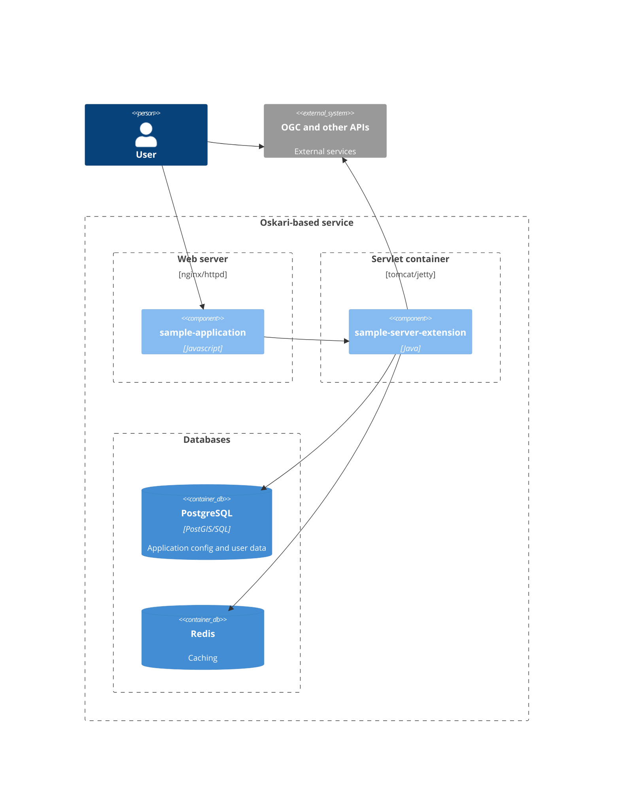

# Setup instructions

This section contains instructions for setting up a new Oskari instance.

```mermaid
C4Deployment

Person(user, "User", "")

Boundary(service, "Oskari-based service", ""){
    Boundary(frontend, "Web server", "nginx/httpd"){
        Component(sample-app, "sample-application", "Javascript")
    }
    Boundary(server, "Servlet container", "tomcat/jetty"){
            Component(sample-server, "sample-server-extension", "Java")

    }
    Boundary(db, "Databases", ""){
        ContainerDb(postgres, "PostgreSQL", "PostGIS/SQL", "Application config and user data")
        ContainerDb(redis, "Redis", "", "Caching")
    }
}
System_Ext(sdi, "OGC and other APIs", "External services")


Rel(user, sample-app, "", "")
Rel(sample-app, sample-server, "", "")
Rel(sample-server, postgres, "", "")
Rel(sample-server, redis, "", "")
Rel(sample-server, sdi, "", "")
Rel(user, sdi, "", "")
```
