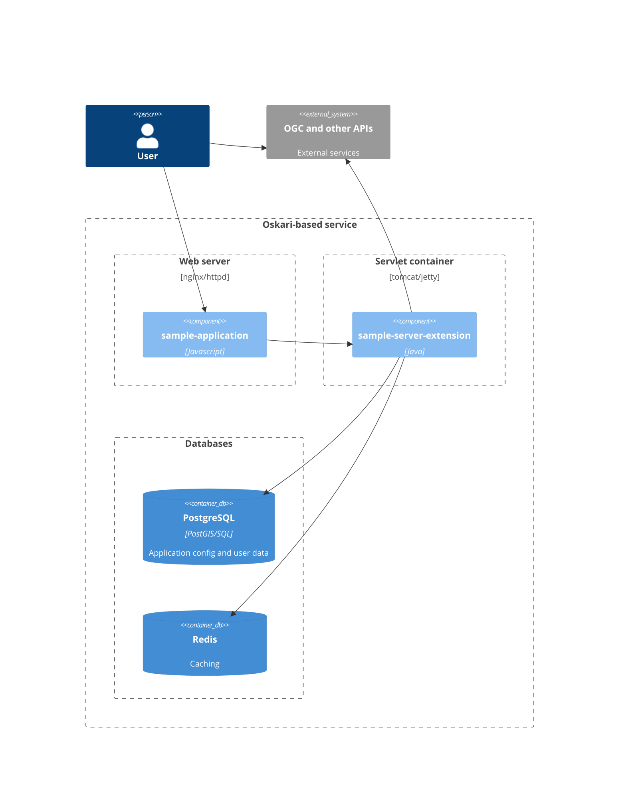

# Setup instructions

This section contains instructions for setting up a new Oskari instance. First a posgreSQL database with PostGIS extension is set up, then the actual Oskari instance with related programs is downloaded and installed. 

This manual focuses on Oskari and gives you the basic guidance to the related software/libraries which should be enough to get you through the setup process. If you encounter issues with PostgreSQL or other Oskari-related libraries, please refer to their respective manuals.

The diagram below shows the system architechture of Oskari.

