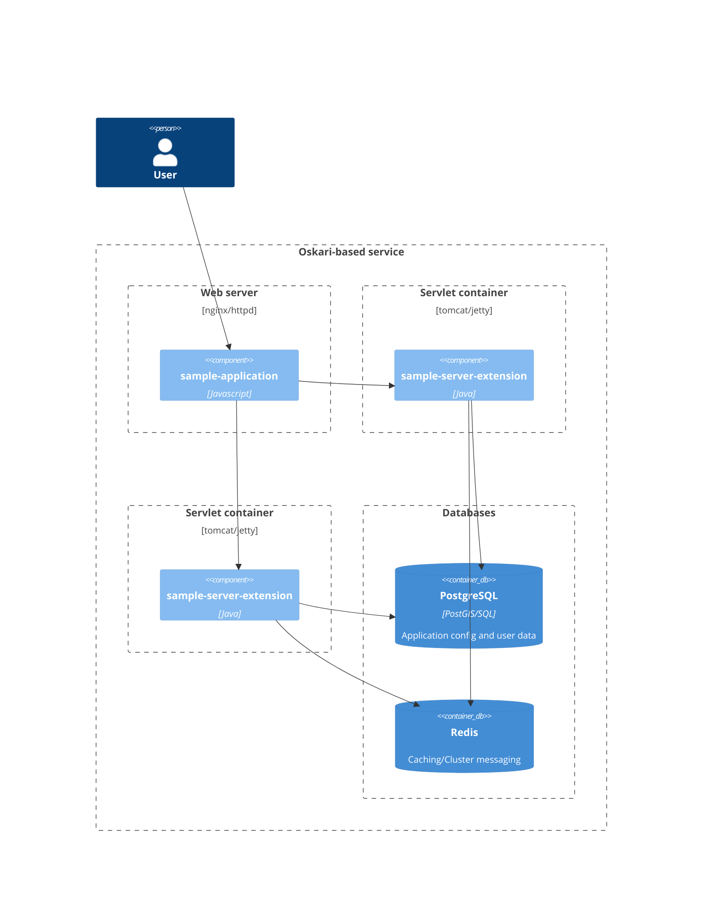

### Configuring a reverse proxy (Optional)

This guide gives an example for configuring a reverse proxy for Oskari-server.
 You can use software such as [nginx](https://nginx.org/) or [Apache httpd](https://httpd.apache.org/) or similar for this and use the chosen server to serve the static frontend application files as well.
 The server can function as a load balancer or just as a dummy proxy that decides to answer with a static file for the frontend application or proxy the request to the underlying application server.

*Using a reverse proxy is not required for development, but is recommended for production use*



### Configurations for production use

#### Gzip

The frontend files and JSON responses from the server can sometimes be quite large and you should turn on `gzip` to reduce the size for network traffic.

**nginx**

In `/etc/nginx/nginx.conf` turn on gzip support by adding:

```
gzip  on;
```

**httpd**

For httpd you can add these lines to your virtualhost configuration file:

```
# Enable gzip for these types
SetOutputFilter DEFLATE
AddOutputFilterByType DEFLATE text/html
AddOutputFilterByType DEFLATE application/javascript
AddOutputFilterByType DEFLATE application/json
AddOutputFilterByType DEFLATE text/css
AddOutputFilterByType DEFLATE text/plain
```

### Example configurations

You can find some example configurations in https://github.com/oskariorg/sample-configs/tree/master/nginx.
The nginx version at the time of writing the configs was 1.8.1 which was used to test these configurations.

Most configurations for nginx can be done in `/etc/nginx/conf.d/default.conf`

Apache httpd has a nice page for setting up reverse proxy: https://httpd.apache.org/docs/2.4/howto/reverse_proxy.html

#### Assumptions

Below are some of the assumptions for the nginx example configurations.

##### Oskari frontend code.

Oskari frontend code should be made available in the server directory `/opt/public/oskari`.
This can be changed by modifying these lines:

```
    root /opt/public/;

    # Oskari frontend files
    location ^~ /Oskari/ {
        rewrite ^/Oskari/(.*)$ $1 break;
        try_files /oskari/$1 oskari/$1/ =404;
    }
```

##### Oskari-server

Oskari server should be running on localhost in port 8080.
This can be changed by modifying these lines:


```
upstream oskariserver {
    server localhost:8080;
}

```

##### Protecting cookies

Before Oskari 3.0 the Java libraries didn't support the SameSite-flag for cookies but `Set-Cookie` headers from the application server can be manipulated by both nginx and httpd.
 We recommend using `secure`, `HttpOnly` and `SameSite=Lax` flags for cookies.

This snippet modifies the cookie the application server gives and adds the flags whenever the application server wants to add a cookie.
 SameSite-flag means that browsers don't send for example the session cookie when requests originate from a different domain.

```
    # Oskari-server application server path
    location / {
        ...

        # set all cookies to secure, httponly and samesite by modifying "path"
        proxy_cookie_path / "/; secure; HttpOnly; SameSite=lax";
    }
```

#### HTTPS-configuration

The following enables HTTPS on the server. Add the certificates on:
- `/etc/nginx/ssl/public.crt` for public key
- `/etc/nginx/ssl/private.rsa` for private key

or change the configuration accordingly.

```
    # ssl config - optional, but recommended for offering https-urls
    listen       443 ssl;
    ssl_certificate /etc/nginx/ssl/public.crt;
    ssl_certificate_key /etc/nginx/ssl/private.rsa;

    # ssl security settings - optional, but recommended
    ssl_protocols       TLSv1 TLSv1.1 TLSv1.2;
    ssl_ciphers         HIGH:!aNULL:!MD5;
    add_header Strict-Transport-Security "max-age=31536000; includeSubdomains";
    server_tokens off;
    # /ssl config
```

Check the chosen server software instructions for securing web servers/listing of current recommended protocols, ciphers etc.
All the usual best practices work and hardening flags works with Oskari as any other web application. The only thing that makes
things a bit different is if you allow users to published embedded maps from your application, these are embedded using iframe.
Usual hardening tips might advice for disabling support for the service to be shown in an iframe, but embedded maps need this to be useful so you shouldn't disable embedding.
