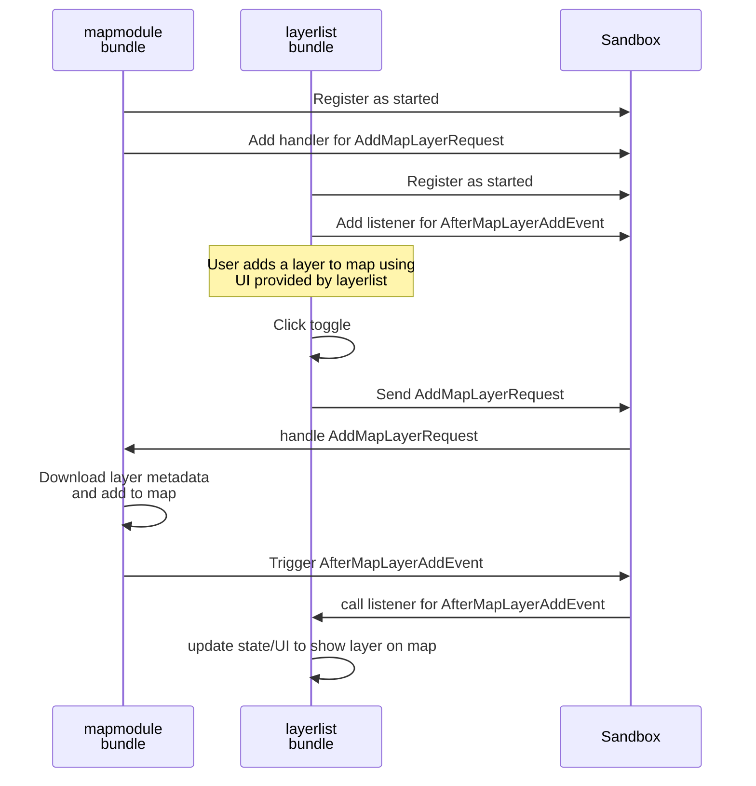

## Oskari global and sandbox

The Oskari frontend framework functionality is located in the `src` folder in [oskari-frontend repository](https://github.com/oskariorg/oskari-frontend/tree/master/src).
The folder also includes React.js based UI-component library (based on AntD-components).

### Oskari global

A global `Oskari` variable is introduced for Oskari frontend applications to access the framework functionalities.

It provides some functionalities that applictions can use (bundles usually) like:
- application environment like:
    - current language `Oskari.getLang()`
    - supported languages `Oskari.getSupportedLanguages()` and `Oskari.getDefaultLanguage()`
    - setup configuration `Oskari.app.getApplicationSetup()`
    - type `Oskari.app.getType()` and uuid `Oskari.app.getUuid()`
    - theme `Oskari.app.getTheming().getTheme()` and `setTheme()`
- instance customization:
    - marker selection `Oskari.getMarkers()` and `Oskari.getDefaultMarker()`
    - default app setups `Oskari.app.getSystemDefaultViews()`
    - urls `Oskari.urls.getRoute('route name')`
- bundle registry `Oskari.bundle()` and `Oskari.lazyBundle()`
- sandbox registry (see below) `Oskari.getSandbox()`
- app/bundle lifecycle handling `Oskari.on('bundle.start')` and `Oskari.on('app.start')`
- tracking of current user `Oskari.user()`
- access to localizations `Oskari.getMsg(locId, locKey, params)`
- class system (being migrated away in favor of ES-classes) `Oskari.clazz.define()` and `.create()`
- helper functions:
    - for colors etc `Oskari.util.hexToRgb('#FFAA33')`
    - number formatting `Oskari.getNumberFormatter()`
    - coordinate formatting `Oskari.util.coordinateMetricToDegrees()`
    - sequence tracking `Oskari.getSeq('sequenceId').curVal()` and `.nextVal()`
    - url building `Oskari.urls.buildUrl('https://mydomain/path', {param: 'value'})`
- DOM element helpers like `Oskari.dom.getNavigationEl()`
- logging functionality `Oskari.log('loggername').warn('some warning')`

### Sandbox

Sandbox is:
- event/message bus for frontend bundles to communicate through requests and events etc
    - `sandbox.postRequestByName('AddMapLayerRequest', [...params]);`
    - `sandbox.notifyAll(someEvent)`
    - `sandbox.addRequestHandler(someReqName, someHandler)`
    - `sandbox.registerForEventByName('AfterMapLayerAddEvent')`
- registry for modules `sandbox.register(this)` (required for listening to events)
    - `sandbox.findRegisteredModuleInstance()`
- registry for services `sandbox.registerService(someService)` and `sandbox.getService(serviceName)`
- conveniency getters for map state:
    - `sandbox.getMap()`
    - `sandbox.findAllSelectedMapLayers()`
- functionality context for scoping events/requests

There can be multiple sandboxes in an Oskari frontend application to scope messaging, but most commonly there is just one that can be accesssed with `Oskari.getSandbox()`.
 The function takes a string-parameter enabling multiple sandbox instances to be used but it's very uncommon to use other than the default sandbox.

Bundle instances get a sandbox reference as parameter on their `start(sandbox)` function and they **should** save and use that reference.
This is handled by `BasicBundleInstance` base class that also provides `getSandbox()` function as a way of using the given sandbox.
This enables scoping the bundle interactions that could be used for having two instances of for example the mapmodule on the same page/Oskari application.

Note that some bundles might use the `Oskari` global to get a sandbox reference (effectively defeating the purpose), but this is not intended use.

