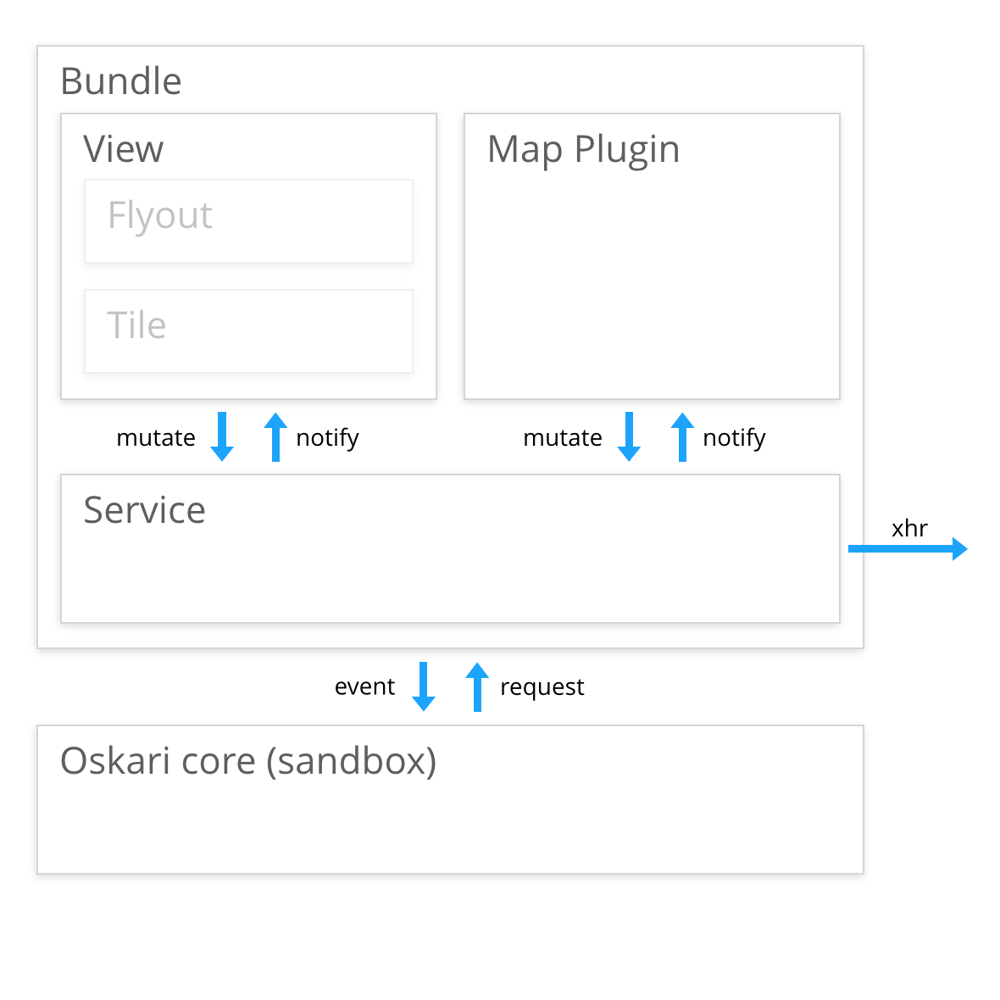

## Bundles

A bundle can be considered as a building block in an Oskari application. A bundle provides some documented functionality and optionally an API that it offers to other bundles for interaction purposes. A bundle has an `id` that is used to document the functionality and the API, but can have multiple parallel implementations with the idea that switching between implementations is a drop-in replacement. An example of this could be a 2D (OpenLayers) and a 3D (Cesium) implementation of the map functionality (`mapmodule`). They both integrate with the rest of the application by providing and using the same documented API, but offer a different experience for the end-user.

The implementation details of a bundle should not really matter, but the API and the functionality they provide should be documented and either be backwards compatible or any changes need to be documented in the changelog.

A comprehensive versioned documentation of all available bundles in `oskari-frontend` can be found [here](https://oskari.org/documentation/api/bundles/latest/) (generated from the [api-folder](https://github.com/oskariorg/oskari-frontend/tree/master/api)).

### Bundle implementation

Minimal implementation of a bundle is just having a factory function for the bundle that returns an instance of the bundle implementation:

```javascript
import { BasicBundleInstance } from 'oskari-ui/BasicBundleInstance';

class MyBundleInstance extends BasicBundleInstance {
    start (sandbox) {
        super.start(sandbox);
        console.log('Hello world')
    }
}

Oskari.bundle('hello-world', () => new MyBundleInstance());
```

Here the `Oskari.bundle()` function is used to register the factory function for bundle id `hello-world`.
You could save the code to `oskari-frontend/bundles/sample/hello-world/index.js` to have it accessible for any Oskari-based applications.
In the path:
- `bundles` is the folder that holds all the bundle implementations
- `sample` would be a namespace for organizing/grouping bundles (you can skip this on application specific bundles)
- `hello-world` should match the bundle id (just to make things easier to find, but is not a requirement)

To use this in an application you would import it to your applications `main.js` with:

```javascript
import 'oskari-bundle!oskari-frontend/bundles/sample/hello-world';
```

Or you could save it application specific bundle as `your-frontend-repo/anywhere_really/whatever.js` and just update the reference for the import on 
 `your-frontend-repo/applications/myapp/main.js`:

```javascript
import 'oskari-bundle!../../anywhere_really/whatever.js';
```

After that the bundle with id `hello-world` can be started as part of your application.
A good practice is to separate the bundle instance to its own file and import it on the `index.js` file so the factory file stays as clean and simple as it can.

**Note!** Making the bundle accessible in your application with import on `main.js` only means that the code is packaged as part of the javascript file that is loaded by the end-users browser.
It doesn't mean it gets run/started on your application.

### Starting a bundle as part of an application

To start a bundle as part of the application it **needs** to be included in the javascript file that is loaded by the end-users browser. This is done by importing it on the `main.js` file of the application.

To actually start an included bundle, there are two choices:
1) have the bundle be referenced in the `GetAppSetup` response from the server (recommended)
2) for testing you can start it in the developer console with `Oskari.app.playBundle({ bundlename: 'hello-world' })`

Applications usually have an `index.js` file that fetches the `GetAppSetup` response from the server with `Oskari.app.loadAppSetup()`.

### Bundle lifecycle

When a bundle is started by the framework:
1) the factory function is called to create an `instance` for the bundle.
2) after creating an instance, variables are injected into the instance object:

```javascript
instance.mediator = {
    bundleId,
    instanceId
}
```
Where:
- `bundleId` is the id you expect (`hello-world` in the example)
- `instanceId` is something that can be used to differentiate multiple instances of the same bundle in a more complex application (defaults to bundle id).

`Oskari.app.getConfiguration()` has configuration for all of the bundles in the application and is usually
 populated from the `GetAppSetup` response from the server with `Oskari.app.loadAppSetup()`. The configuration has keys matching bundle instanceIds (defaults to bundle ids)
 with value of an object. The object can usually have `conf` and/or `state` keys and these are injected as-is to the instance object as variables.

3) The `start()` function is called by the framework when the bundle is started as a part of an application.

The start-function receives a reference to the Oskari sandbox as parameter and if you pass that to `BasicBundleInstance` base class with `super.start(sandbox)` it is accessible with `this.getSandbox()` in the other functions you might want to implement on your bundle.

4) The `stop()` function can be called by for example the publisher functionality

The bundle should do any cleanup in the stop-function like stop listening to events, unregister itself and any request handlers it has added etc.
 
### Bundle architecture

Starting with 1.48.0 Oskari supports writing bundles in JavasScript ES6. This update allows many improvements to the way Oskari bundles are composed.



**Service**
It's the Service's responsibility keep the state related to the bundle business logic consistent and updated. Possibly saving this state to the backend via action routes when needed. The Service exposes public methods to mutate the state and allows other components within the bundle to register for notifications about state changes.

**View**
It's the View's responsibility to update the Flyout/Tile DOM accordingly when it receives notification from the Service that state has changed. It's also the View's responsibility to mutate the Service as a reaction to user input. Flyouts, Tiles, Popups etc. are parts of the View.

**Map Plugin**
It's the Map Plugin's responsibility to update the map related presentation when it receives notification from the Service that state has changed. If the bundle does not have map related functionality, it doesn't need to implement a Map Plugin. Map layers, map controls, map interactions are implemented by Map Plugins.

**Data flow**
User input -> View/Plugin mutates Service by calling a public method on the Service -> Service updates internal state (possibly saving to backend) -> Service notifies all interested components by triggering an event -> Listening components (Views & Map Plugins) update their presentation.

**Communication between bundles**
If a bundle wants to allow other bundles to interact with itself, the bundle can register requests and publish events to Oskari sandbox.

A Service can also be exposed to other bundles with a call to sandbox.registerService(service). Afterwards other bundles can obtain a reference to the service by calling sandbox.getService(serviceName).

**External dependencies**
If you bundle depends on external library code, the libary must be referenced to be included into the build.

If the library is a part of oskari-frontend repository (lodash, d3, etc.), or generally if the library is distributed a separate JS file you should reference it in your bundle.js.

If you want to use libraries distributes as NPM modules, you can npm install --save them and import as usual. But check first that the library isn't in use under oskari-frontend libraries/ to avoid duplication of library code.

### Bundle manager/loader

- loads Bundle Definitions
- manages bundle state and lifecycle
- loads Bundle JavaScript sources and CSS resources
- instantiates Bundle Instances
- manages Bundle Instance lifecycle

The code for Oskari class system/bundle manager/Oskari loader can be found in Oskari/src. The minified version of this is available in Oskari/bundles/bundle.js and a new version of this core-functionality can be built by running npm run core command in Oskari/tools folder.
