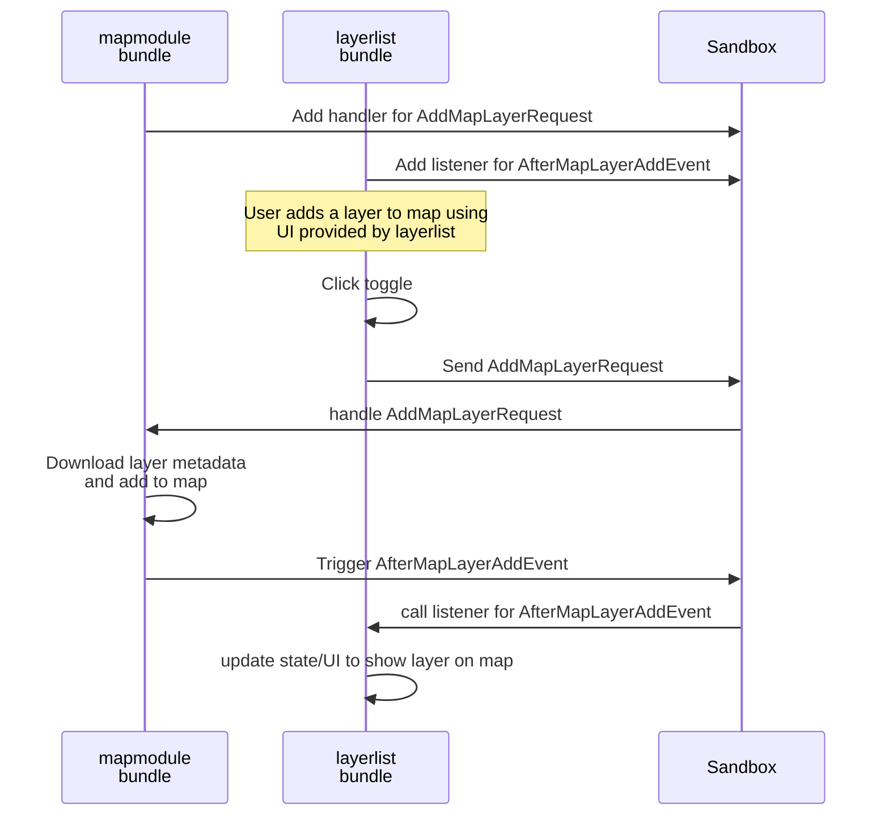

## Bundle API

Bundles can interact with each other through the API that bundles themselves provide. These are separated into three categories:
- `request` for requesting something to be done (serializable to JSON)
- `event` for notifying that something happened (serializable to JSON)
- `service` when direct function calls are required between bundles

The Oskari sandbox is the message bus for all of these categories:

### Bundle requests

Requests can only have _one handler_/bundle that handles them. Other bundles `request` something to be done by the bundle that offers a request API.

A comprehensive versioned documentation of all available bundle requests can be found [here](https://oskari.org/documentation/api/requests/latest/)

### Bundle events

Events can have multiple listeners like you would expect. Bundles that offer an `event` API expect other bundles to be interested about the things they do and can notify other bundles when that something has happend.

A comprehensive versioned documentation of all available bundle events can be found [here](https://oskari.org/documentation/api/events/latest/)

### Bundle services

Most communication between bundles should happen through the `request`/`event` API, but it's not always possible. When you can't serialize the messages to JSON or just need direct function API you should use services for that functionality for the bundle.
 Bundles can expose a service that is registered to the sandbox to let other bundles get a reference to the service and call the service functions. This is the recommended way of coupling bundles when a direct function call is required.

 Another way of doing this is getting a reference to a bundle instance through `sandbox.findRegisteredModuleInstance(instanceName)` and that is fairly common in `oskari-frontend` as well, but a better approach would be to use the services. With services we can expose a reasonable set of functions required for things to work without exposing the whole bundle implementations. This leads to better decoupling and less accidental bugs as the bundle internals can be updated and changed without worrying if other bundles call their functions directly.

 Services should have similar API documentation as `requests` and `events`. Unforturnately they don't at the moment, but services is the one API we could document and try to have backwards-compatible through versions and/or document any changes to the API changelog. Doing the same for any internals of all the bundles is basically impossible as it would grind every update to a halt.

 So whenever you would want to call a function in a bundle directly, you should seriously consider making a pull request instead to add/modify a service to expose that function instead. Otherwise direct function calls (or even worse, referencing an internal variable from another bundle) are very fragile and fiddly to work with in regards of _maintaining_ an application. It probably works now, but is very easily broken in a version update and the bug could be hard to find at that time.
