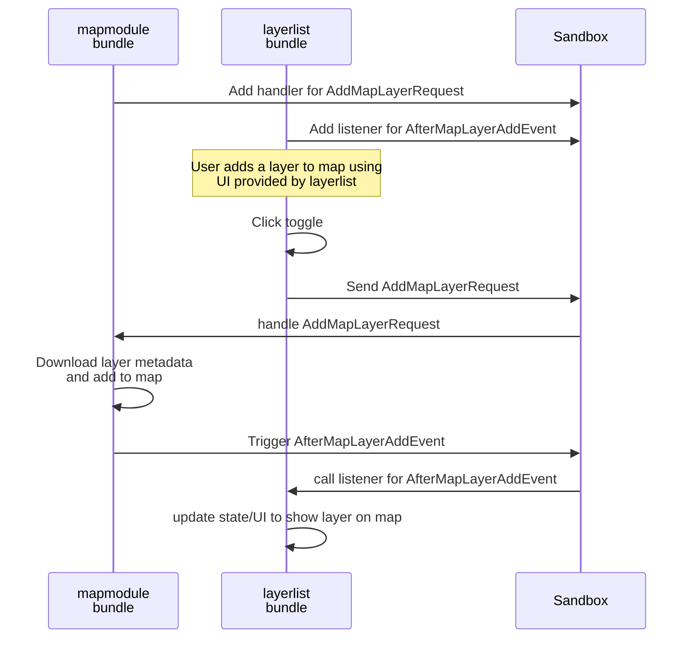

## Bundle API

Bundles can interact with each other through the API that bundles themselves provide. These are separated into three categories:
- `request` for requesting something to be done (serializable to JSON)
- `event` for notifying that something happened (serializable to JSON)
- `service` when direct function calls are required between bundles

The Oskari sandbox is the message bus for all of these categories:



### Bundle requests

Requests can only have _one handler_/bundle that handles them. Other bundles `request` something to be done by the bundle that offers a request API.

A comprehensive versioned documentation of all available bundle requests can be found [here](https://oskari.org/documentation/api/requests/latest/)

#### Providing request API

A bundle can define a request that it wants to provide as its API with a javascript file like this:

```javascript
Oskari.clazz.define('Oskari.sample.HelloRequest',
    function (target = 'World') {
        this.target = target;
    }, {
        __name: 'HelloRequest',
        getName: function () {
            return this.__name;
        },
        getTarget: function () {
            return this.target;
        }
    }, {
        protocol: ['Oskari.mapframework.request.Request']
    });
```
Where:
- `name` is the request name and references to the request are done using the name
-  the `constructor parameters` are values that the handling code needs to do what the request is supposed to do. They can be partially or even fully optional.
- the `protocol` at the end is required for Oskari to find any of the request files by just using the request name

By convention the request file should be placed in a `request`-folder under the bundles implementation folder. The bundle should then also register a handler for the request in the sandbox. If the request handler is complex you should have the code in a separate file in the request-folder, but simple ones can be done in the bundle instance file for example.

**Note!** The request file needs to be imported as part of the bundle so they are included in the build. Even as they usually are not directly referenced by the importing code:

```javascript
import './request/HelloRequest';
```

Registering the handler is done like this when extending the `BasicBundleInstance` class:
```javascript
this.addRequestHandler('{the request name}', (req) => /* use request methods to get parameters and do what was requested */);
```
You can also use sandbox functions directly:
```javascript
sandbox.requestHandler('{the request name}', (req) => handlerFn(req));
```
Remember that you should cleanup the handler in `stop()` and you need the request name to do that. So you may want to store which handlers are registered so you can restart after stopping etc. The `BasicBundleInstance` class handles this automatically.

Removing a handler is done like this when extending the `BasicBundleInstance` class:
```javascript
this.removeRequestHandler('{the request name}');
```
You can also use sandbox functions directly:
```javascript
sandbox.requestHandler('{the request name}', null);
```

#### Using the request API

When you need to do something that another bundle already provides an API for, you can use the request API to execute that functionality through the Oskari sandbox:

```javascript
sandbox.postRequestByName('{the request name}', ['{request contructor params}', '{as an array}']);
```
If you want to check if anything in the current application is listening to the request you can do this:
```javascript
if (!sandbox.hasHandler('{the request name}')) {
    // nothing is listening to the request I want to use
    // do error handling or try again later
} else {
    const theRequestingComponent = this;
    const requestBuilder = Oskari.requestBuilder('{the request name}');
    sandbox.request(theRequestingComponent, requestBuilder('{request contructor params}', '{as values}'));
}
```
The request handler might be registered later on at application startup or missing completely from the application and you might need to deal with this as error handling. The example also shows another way of sending requests, but you can use the `postRequestByName()` instead of requestBuilder as its easier to work with.

### Bundle events

Events can have multiple listeners like you would expect. Bundles that offer an `event` API expect other bundles to be interested about the things they do and can notify other bundles when that something has happend.

A comprehensive versioned documentation of all available bundle events can be found [here](https://oskari.org/documentation/api/events/latest/)

#### Providing event API

A bundle can define an event that it wants to provide as its API with a javascript file like this:

```javascript
Oskari.clazz.define('Oskari.sample.HelloEvent',
    function (target = 'World') {
        this.target = target;
    }, {
        __name: 'HelloEvent',
        getName: function () {
            return this.__name;
        },
        getTarget: function () {
            return this.target;
        }
    }, {
        protocol: ['Oskari.mapframework.event.Event']
    });
```
Where:
- `name` is the event name and references to the event are done using the name
-  the `constructor parameters` are values that the listening components might want to know about the change. They can be partially or even fully optional.
- the `protocol` at the end is required for Oskari to find any of the event files by just using the event name

By convention the event file should be placed in a `event`-folder under the bundles implementation folder.

**Note!** The event file needs to be imported as part of the bundle so they are included in the build. Even as they usually are not directly referenced by the importing code:

```javascript
import './event/HelloEvent';
```

Sending an event is done like this:
```javascript
const eventTemplate = Oskari.eventBuilder('HelloEvent');
sandbox.notifyAll(eventTemplate('{event contructor params}', '{as values}')
```

#### Listening to events

Other bundles can listen and react to things happening on the application. When extending the `BasicBundleInstance` class listening to events can be done like this:

```javascript
this.on('HelloEvent', (evt) => {
    console.log(`Hello ${evt.getTarget()}`);
});
```
**Note! Adding a event listener for the same event name in `BasicBundleInstance` class currently overwrites the previous listener.**

On many cases in oskari-frontend the event listening is much more complex and `BasicBundleInstance` class tries to hide this complexity, but it's good to know how it works behind the scenes. Listening to events requires a bundle to register itself into the sandbox with:

```javascript
sandbox.register(this);
```
The `this` in the example is an object with functions `init()` and `getName()`. In addition for listening events a `onEvent(event)` function is required. Usually this is the bundle instance itself. The `init()` function is called by the sandboxes `register()` function itself.

After registering to sandbox, the object/instance can start listening to events with:

```javascript
sandbox.registerForEventByName(this, '{event name to listen}');
```

After this when an event is triggered the objects/instances `onEvent()` function is called with the event as parameter.

```javascript
onEvent (event) {
    const handler = this._eventListeners?.listener(event.getName());
    if (!handler) {
        return;
    }
    return handler(event);
}
```
It's common in `oskari-frontend` that references to eventListeners are stored in an object like `_eventListeners` as instance variable so it's easy to loop through when we need to cleanup any listeners and have a boilerplaty `onEvent()` implementation like above.

Remember that you should cleanup the event listeners in `stop()` and you need the event name to do that. So you may want to store which events are being listened to so you can restart after stopping etc. The `BasicBundleInstance` class handles this automatically.

```javascript
sandbox.unregisterFromEventByName(this, '{event name to stop listening}');
```

### Bundle services

Most communication between bundles should happen through the `request`/`event` API, but it's not always possible. When you can't serialize the messages to JSON or just need direct function API you should use services for that functionality for the bundle.
 Bundles can expose a service that is registered to the sandbox to let other bundles get a reference to the service and call the service functions. This is the recommended way of coupling bundles when a direct function call is required.

 Another way of doing this is getting a reference to a bundle instance through `sandbox.findRegisteredModuleInstance(instanceName)` and that is fairly common in `oskari-frontend` as well, but a better approach would be to use the services. With services we can expose a reasonable set of functions required for things to work without exposing the whole bundle implementations. This leads to better decoupling and less accidental bugs as the bundle internals can be updated and changed without worrying if other bundles call their functions directly.

 Services should have similar API documentation as `requests` and `events`. Unforturnately they don't at the moment, but services is the one API we could document and try to have backwards-compatible through versions and/or document any changes to the API changelog. Doing the same for any internals of all the bundles is basically impossible as it would grind every update to a halt.

 So whenever you would want to call a function in a bundle directly, you should seriously consider making a pull request instead to add/modify a service to expose that function instead. Otherwise direct function calls (or even worse, referencing an internal variable from another bundle) are very fragile and fiddly to work with in regards of _maintaining_ an application. It probably works now, but is very easily broken in a version update and the bug could be hard to find at that time.
