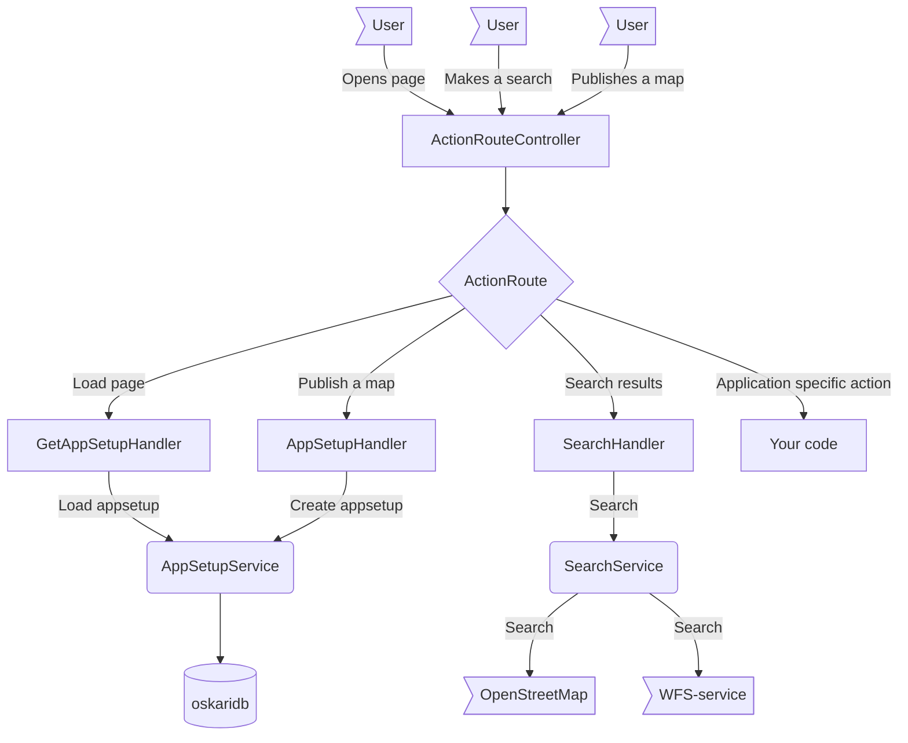

# Server application

This section dives into the server functionalities.

## Using oskari-server in applications

Applications can use oskari-server as dependencies with this on their `pom.xml` file:

```xml
<properties>
    <oskari.version>3.0.0</oskari.version>
</properties>

<dependencyManagement>
    <dependencies>
        <dependency>
            <groupId>org.oskari</groupId>
            <artifactId>oskari-server</artifactId>
            <version>${oskari.version}</version>
            <scope>import</scope>
            <type>pom</type>
        </dependency>
    </dependencies>
</dependencyManagement>

<repositories>
    <repository>
        <id>oskari_org</id>
        <name>Oskari.org release repository</name>
        <url>https://oskari.org/repository/maven/releases/</url>
    </repository>
    <repository>
        <id>oskari_org_snapshot</id>
        <name>Oskari.org snapshot repository</name>
        <url>https://oskari.org/repository/maven/snapshots/</url>
    </repository>
</repositories>
```
This defines:
- Oskari version to use (so it's easy to update in one place)
- managed dependencies used by the Oskari-version you are using to prevent accidentally using multiple versions of same dependency
- the Maven repositories that provide pre-compiled jar-files for Maven modules in [oskari-server](https://github.com/oskariorg/oskari-server)


After this, you can use any Maven modules under oskari-server or any of its managed dependencies without a version like this:

```xml
<dependencies>
    <dependency>
        <groupId>org.oskari</groupId>
        <artifactId>servlet-map</artifactId>
    </dependency>
    ...
</dependencies>
```

## Spring Controllers

Oskari-server uses Spring framework as a wrapper for handling HTTP-requests and security. There are two main Controllers handling most of the requests: `MapController.java`and `ActionRouteController.java`.

Under `servlet-map` [module](https://github.com/oskariorg/oskari-server/tree/master/servlet-map/src/main/java/org/oskari/spring/controllers)

### MapController

Handles which JSP file should be used for the application the end-user requests and sets up some information for the JSP to use for rendering the base HTML for the frontend.
There are two main JSP-files that both have defaults under [servlet-map](https://github.com/oskariorg/oskari-server/tree/master/servlet-map/src/main/resources/META-INF/resources/spring-map-jsp): `index.jsp` for geoportal app and `published.jsp` for embedded maps.

You can override the default JSP-files with your own or add your own like shown on the [sample-server-extension](https://github.com/oskariorg/sample-server-extension/tree/master/webapp-map/src/main/webapp/WEB-INF/jsp).

The `org.oskari.spring.SpringConfig` file defines the locations of the JSP files. You can define your own directory with `oskari-ext.properties` with `oskari.server.jsp.location = /WEB-INF/jsp/` (default location for overrides) and the server first searches from that location and defaults to the `/spring-map-jsp/` path in classpath if not found. 

### ActionRouteController

Handles the requests made by the frontend application. Oskari uses a concept of "action route" for processing requests made by the frontend application. Requests for action routes are processed like this:



### Other Controllers

#### StatusController

There is also a `StatusController.java` that can be used for load balancing/health checks.

#### UserRegistrationController

The control-users maven module can be used for enabling end-users to self-register to the application. It has another controller for that purpose:

https://github.com/oskariorg/oskari-server/blob/master/control-users/src/main/java/fi/nls/oskari/spring/UserRegistrationController.java
