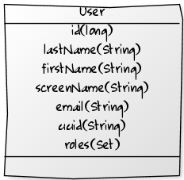
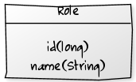

## User management

Some Oskari modules utilize role-based user management, allowing users with different roles to access specific functionalities. For example, only logged-in users can view certain layers or spesific user groups can add or edit map layers within the service. The spring security framework that Oskari uses can be customized to different use cases.

### How to use user authentication

Users in Oskari are described with a few attributes listed below:

The datasource for users can be configured to read and manage users using JSON, SAML etc, but default to the core database for Oskari. The Java-interface for managing users is `fi.nls.oskari.service.UserService` under the service-base Maven module with `fi.nls.oskari.user.DatabaseUserService` under service-users Maven module as the reference implementation.

Permissions for resources are mapped using roles and user-specific content uses the UUID to link the content with the user.

TODO: description/use cases for UserService implementations.
