## Map layer administration

Bundle that provides admin functionality for dataproviders is `admin-layereditor`. 

The functionality is usually configured to be lazy-loaded for users that have the `admin` role.
The user-interface for layerlisting is modified by this functionality to add admin-functionality.

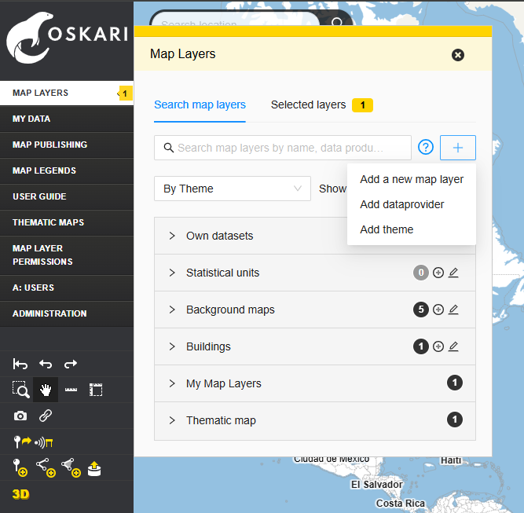

### Adding data providers

Open the `Map Layers` from the menu bar. Click the plus button and select `Add dataprovider`.

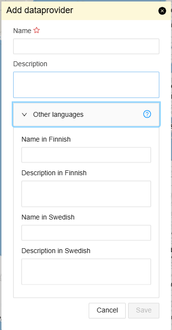

Note! Languages including the default language are configurable. The localized value for default language is used when a specific language version has not been entered by admins.

Enter the name of the data provider. Remember to click ‘Save’ at the end.

The new data provider has now been created.

### Editing a data provider

Open the `Map Layers` menu. To access the data provider listing and make searching easier, you can change the grouping of map layers to `By Data Provider` using the dropdown menu:

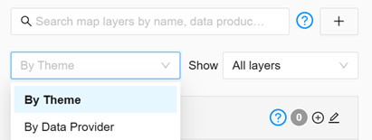

Click the edit icon next to the name of the data provider:

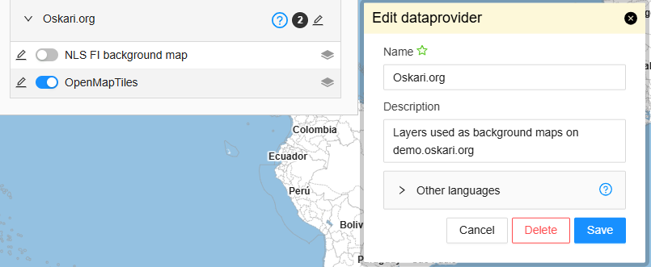

Edit the fields you want to modify and click `Save`. The description is shown to end-users as a tooltip with the question mark icon on the grouping of map layers.

You can also delete a data provider by clicking `Delete`. However, note that you cannot delete a data provider if it has any map layers under it. In that case, the map layers must first be moved under a different data provider or deleted before the data provider can be removed.

### Adding themes

Themes are the default grouping for map layers in the layer listing.

Open the `Map Layers` from the menu bar. Click the plus button and select `Add theme`.

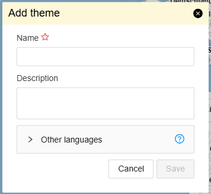

Enter the name for the theme. Remember to click ‘Save’ at the end.

Note! Languages including the default language are configurable. The localized value for default language is used when a specific language version has not been entered by admins.

The new theme has now been created. The description is shown to end-users as a tooltip with the question mark icon on the grouping of map layers.

### Editing a theme

Click the edit icon next to the name of the theme:

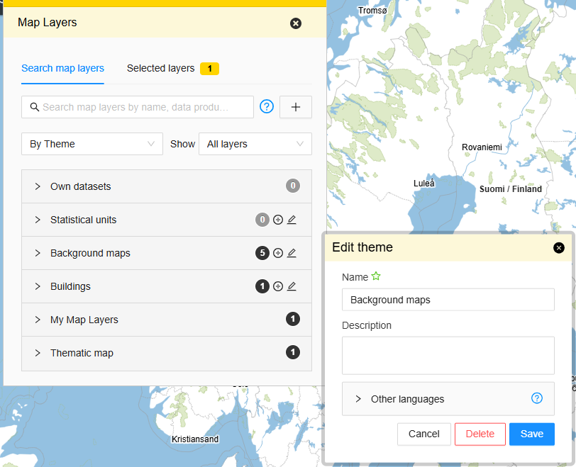

Edit the fields you want to modify and click `Save`.

You can also delete a theme by clicking `Delete`. However, note that you cannot delete a theme if it has any map layers under it. In that case, the map layers must first be moved under a different theme or deleted before the theme can be removed.

### Adding a new map layer

Open the `Map Layers` from the menu bar. Before adding a new map layer, make sure that the corresponding data provider and theme already exist in the service. Click the plus button and select `Add a new map layer`.

Next, you need to select the type of layer to be added. The most common types of map layers are `WMS` and `WFS` (Note that OGC API Features are defined as WFS-layers with version 3), but many other types can also be added. 

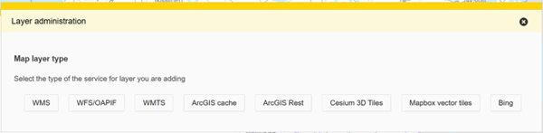

The following steps in this guide walk you through adding a WMS layer as an example, but the process is similar for other types as well. However the fields that are available on the form are determined by layer type.

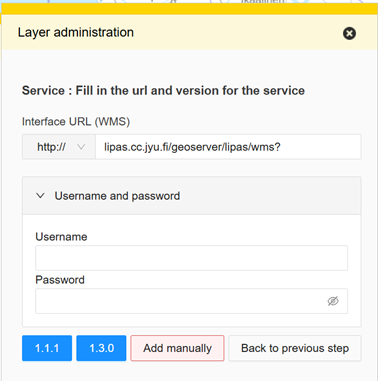

First, fill in the interface URL and the standard version. You can also add a username and password if required.

After selecting the version, you will automatically proceed to the next step, where you will see a listing of layers that are available on the service you defined (these are determined by the GetCapabilities operation for OGC services).

Note! If you know a layer exists but is not advertized on the GetCapabilities listing, you can use the `Add manually` button instead of the version button. This will make it harder to add the layer, but allows you to proceed even if the service capabilities are not listing a layer.

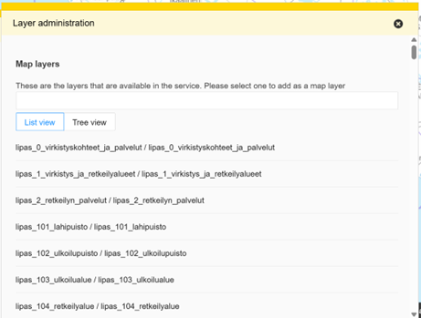

Now, you can select the desired layer to be used as a map layer. If the service exposes many layers, you can use the search function and/or the tree view to filter the list and find the one you are looking for. The listing shows both the technical name for the layer and the title of the layer from the service capabilities. Note that some layers can have icons next to the name. These are used to indicate if a layer from that service has already been added or if there can be some issues when adding the layer. The tooltips will help you navigating these. The layers are sorted so that ones that have not been added are listed at the top.

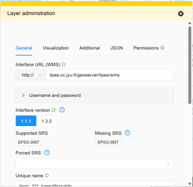

After selecting the layer, you can edit the layer's information. At the top, you can see several tabs for editing different aspects of the map layer. Some fields, like the url and version, are prefilled because you already entered them previously. Other fields, like the name for the layer, might be prefilled from values detected from the GetCapabilities response from the layer.

The `Add` button at the bottom of the form adds the new layer, so only click it once you've made sure all the fields are correctly set. You can always return to edit the layer after saving and this is also very usual to do when maintaining the map layers as layers on the services you are using might change etc. The `Add` button is disabled until you have added all the required information. Pressing the `Close` button will not save the changes.

#### General tab

In the `General` tab, you can edit the basic information of the map layer. Most importantly, this includes the name, description, data provider, and the layer's groups (themes).

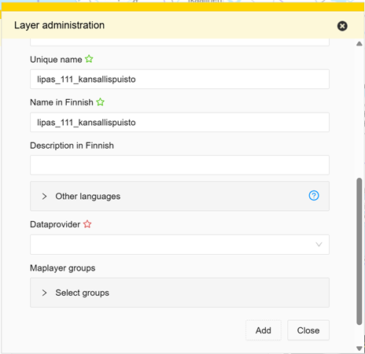

#### Visualization tab

In the `Visualization` section, you can adjust how the map layer appears, such as its style and scale (/zoom level) limits when the layer should be visible. The scale limits is an option to improve end-user experience with layers that have a lot of data and/or are slow to use from the service. Some layers also provide scale limits on the GetCapabilities response. The service is likely to not give the data outside the limits listed on it's Capabilities response.

For vector layers like WFS/OGC API Features layers there are additional fields for things like:
- adding styling for features on map
- adding localizations for feature property names
- formatting for feature property values

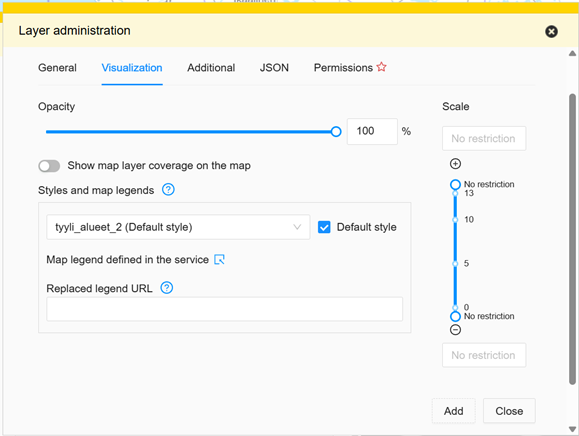

#### Additional tab

The `Additional` tab includes more editable fields, though these are fields that are not that as commonly used.

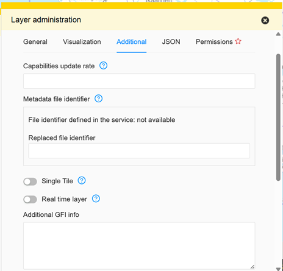

#### JSON tab

In the `JSON` tab, you can further customize the map layer in more detail and check the parsed capabilities response for the layer.

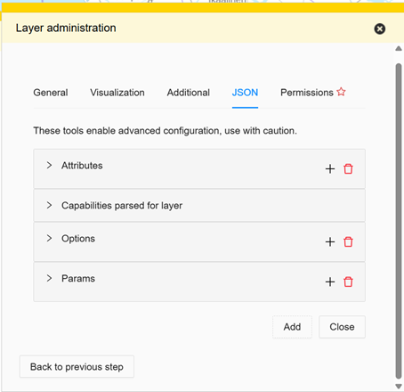

#### Permissions tab

In the `Permissions`, you can define who can use the map layer and how they can use it.

By default, no permissions are granted for any map layer, even viewing rights must be added separately. Usage permissions are always granted to roles, not individual accounts. 

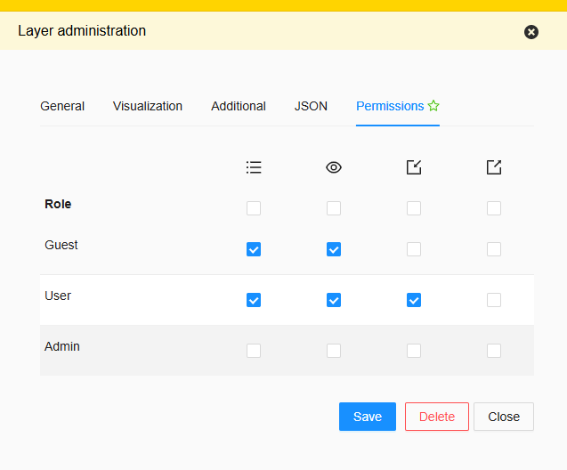

Summary of different permissions:

| Permission type | Meaning |
| ---------- | ------- |
| `View` | User can see the map layer in layer listing |
| `View in embedded map` | User can see the map layer on an embedded map (id reference required through an embedded map or link) |
| `Publish` | User can use the map layer when creating an embedded map with the publisher functionality |
| `Download` | User can download the feature properties (as CSV) through the UI |

Permissions are most commonly granted to roles as follows:
- `Guest` role: given view permission so that end users that have not logged in can see the map layer (if you want to use the layer in an embedded map, this is basically a must since users of an embedded map are usually not logged in. However if you do have a login form on the embedded map or have some sort of SSO-solution, you might want to tinker with this). Note that `Guest` users can't use the publisher functionality so giving Guest user the `Publish` doesn't really do anything.
- `User` role (logged in user): given view permission so that end users can see the map layer (not inherited from `Guest`)
- `Admin` role: If you want to test the layer as an admin before exposing it to other users, you can let the admins see the layer before giving permissions to `Guest` and/or `User` roles. Note that all logged in users usually have the user role in Oskari-based applications (Admins usually just have an _additional_ `Admin` role) so having permissions for `User` and `Guest` roles are usually enough. 

The usual permission set to give a layer so it's visible to both logged and not logged in users is having both view permissions to both `User` and `Guest` roles. If you have the publisher functionality as part of your application you can give the `Publish` permission to layers that users are allowed to use on embedded maps, but don't forget to add at least the `View in embedded map` to `Guest` role for any such layer.

Note! Permission types can be added to Oskari-based services. An example of this would be `Edit layer` permission that is used by the `content-editor` bundle to allow editing of features on an WFS-layer through the user-interface.
Note 2! Roles can be added. An example would be to restrict some layers to be only shown to a subset of logged in users or allowing the previously mentioned `Edit layer` permission to a subset of logged in users.
Note 3! Roles can be renamed. Even the `Guest`, `User` and `Admin` roles.

### Editing a map layer

To edit a map layer, Click the edit icon next to the name of the map layer:

This will open a similar window to when creating a new map layer, where you can modify the layer’s details.

When a layer is being modified you have more buttons on the bottom of the form:
- `Delete` to remove the layer. Note, that if the layer has been used by users on their embedded maps. That layer won't open on the embedded map, but otherwise the embedded map works like before. Some RPC-based applications built on top of embedded maps might become faulty if they expect to find the layer on the embedded map.
- `Add a new layer from same service` allows you to add another layer from the same service. Adding a layer this way allows you to skip the first two steps of adding a layer since the layer type, url and version is already known.
